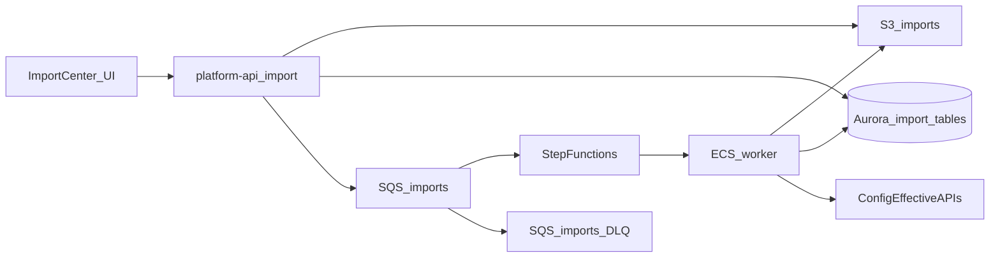

# Universal Import Platform — Implementation Plan & Sprint Breakdown

**Status:** Architecture package complete — implementation sprints gated on review  
**Date:** 2026-07-28

## Architecture shape

- Browser never parses/validates full files; API issues short-lived upload URLs; worker/engine does detection, mapping, validation, commit.
- Profiles resolve **published** Configuration Platform `import_config` (and related namespaces); job tables store mapping snapshots for audit/replay.
- Step Functions orchestrates long-running stages (CDK in a later sprint); SQS carries job messages; DLQ for poison messages.

## Sprint breakdown

| Sprint | Focus | This architecture stop |
| --- | --- | --- |
| **S0** | Architecture docs, draft `0022`, API contracts, `@forge/imports` skeleton, support docs | **COMPLETE (this package)** |
| **S1** | Finalize/apply `0022`, FORCE RLS, permission seed, isolation tests, audit defs | After architecture approval |
| **S2** | Nest import APIs + control plane (presigned upload deferred if scoped separately) | After S1 |
| **S3** | Engine CSV/XLSX/JSON + upload/storage orchestration | After S2 |
| **S4** | Duplicates + ZIP/API sources | After S3 |
| **S5** | Worker + Step Functions wiring | After S4 |
| **S6** | Malware wiring + masking exports | After S5 |
| **S7** | Import Center UI (Creator + Tenant Admin) | After APIs stable |
| **S8** | DoD hardening (Playwright, a11y, ops) | After S7 |
| **S9+** | Product adapters (Academy / RMS / Industrial) | After shared DoD |

## S0 exit criteria (this delivery)

- [x] Ten architecture docs under `docs/architecture/import-platform/`
- [x] Draft migration `0022_import_platform.sql`
- [x] API specification + OpenAPI stub
- [x] `@forge/imports` types, interfaces, NOT_IMPLEMENTED stubs, unit smoke
- [x] User / ops / security / test supporting docs
- [x] Roadmap Phase 12 linked to this package

## STOP

Architecture & skeleton package is complete.  
Do **not** begin Academy / RMS / Industrial-specific importers in this stop.  
Do **not** treat full engine/worker build-out as in scope of S0.
