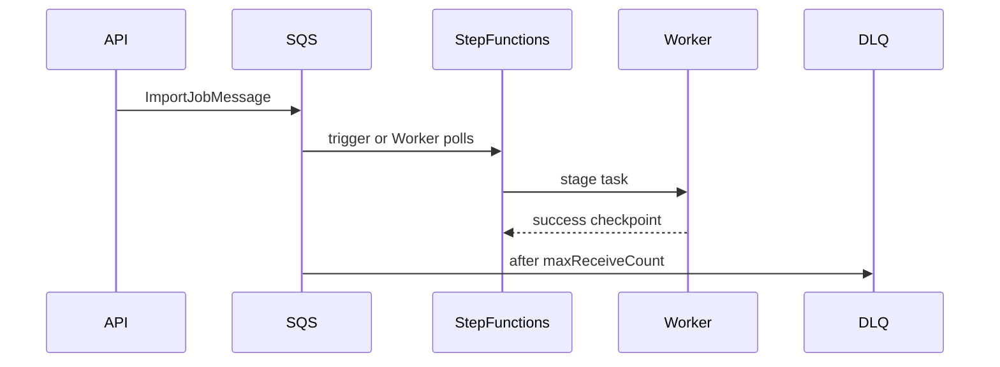

# Universal Import Platform — Queue Architecture

**Status:** ARCHITECTURE  
**Date:** 2026-07-28

## Existing AWS resources (reuse)

| Resource       | Naming pattern                                             |
| -------------- | ---------------------------------------------------------- |
| Imports queue  | `forge-{env}-sqs-imports`                                  |
| Imports DLQ    | companion DLQ from `forge-queues` construct                |
| Imports bucket | `forge-{env}-...-imports` (uniqueBucketName)               |
| Env            | `SQS_IMPORT_QUEUE_URL`, `S3_IMPORT_BUCKET` on API + worker |

## New (implementation sprint)

| Resource                            | Purpose                           |
| ----------------------------------- | --------------------------------- |
| Step Functions state machine        | Stage orchestration for long jobs |
| Optional scan Lambda / GuardDuty MP | Malware                           |

## Message flow



Preferred pattern: API enqueues `ImportJobMessage`; worker (or EventBridge Pipe) starts Step Functions execution; SF invokes worker tasks per stage (or worker polls SQS and drives SF). Final choice locked in implementation sprint; **jobs remain idempotent and tenant-aware either way**.

## Message schema (logical)

```json
{
  "type": "import.job.execute.v1",
  "tenantId": "uuid",
  "jobId": "uuid",
  "stage": "VALIDATE|EXECUTE|ROLLBACK",
  "attempt": 1,
  "correlationId": "hex",
  "idempotencyKey": "string"
}
```

## Guarantees

| Property         | Approach                                              |
| ---------------- | ----------------------------------------------------- |
| Idempotent       | Stage checkpoints in `import_jobs` / `import_batches` |
| Retryable        | SQS visibility timeout + SF retries with backoff      |
| Tenant-aware     | `tenantId` in message; worker sets RLS GUC before DB  |
| Auditable        | Audit write per stage transition                      |
| Poison isolation | DLQ after N receives; alarm on DLQ depth              |

## Monitoring

- Queue depth / age alarms (Messaging monitoring already references imports queue)
- DLQ depth alarm
- Step Functions failed execution alarm (when provisioned)
- EMF metrics (future): `ImportJobsStarted`, `ImportJobsFailed`, `ImportRowsCommitted`, `ImportRollbackFailures`
