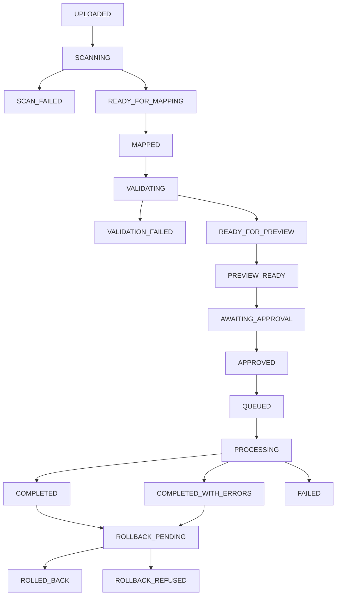

# Universal Import Platform — Workflow

**Status:** APPROVED_WITH_CONDITIONS resolved (S1)  
**Date:** 2026-07-28

## Canonical job statuses

Use **exactly** these values in DB check constraints, APIs, events, workers, and Step Functions:

| Status | Description |
| --- | --- |
| `UPLOADED` | File registered; scan not complete |
| `SCANNING` | Malware scan in progress |
| `SCAN_FAILED` | Fail-closed; do not parse |
| `READY_FOR_MAPPING` | Scan CLEAN; headers/sheets available |
| `MAPPED` | Column mappings saved |
| `VALIDATING` | Validation running |
| `VALIDATION_FAILED` | Blocking validation errors |
| `READY_FOR_PREVIEW` | Validation passed (warnings allowed) |
| `PREVIEW_READY` | Preview materialised |
| `AWAITING_APPROVAL` | Human/system approval required |
| `APPROVED` | Approved; not yet queued |
| `QUEUED` | Message enqueued |
| `PROCESSING` | Background commit running |
| `COMPLETED` | All batches committed cleanly |
| `COMPLETED_WITH_ERRORS` | Finished with rejected rows retained |
| `FAILED` | Unrecoverable execution failure |
| `ROLLBACK_PENDING` | Rollback requested / running |
| `ROLLED_BACK` | Rollback completed |
| `ROLLBACK_REFUSED` | Safety class refused rollback |
| `CANCELLED` | Cancelled before commit |

Do not introduce alternate status names without an ADR.

## Pipeline stages

## Malware fail-closed

1. Register file → `UPLOADED` → `SCANNING`.  
2. Scanner returns CLEAN → `READY_FOR_MAPPING`.  
3. Infected / error / timeout → `SCAN_FAILED`; object quarantined; no header detection.

## Idempotent retries

- Re-POST execute with same job idempotency key returns existing execution state.  
- Batch workers claim rows by `operation_key`; duplicate claim is a no-op.  
- Visibility timeout / SF retry must re-enter the same stage checkpoint.

## Human gates

Mapping confirmation, preview approval, merge-review duplicates, rollback confirmation when `CONDITIONAL`.
