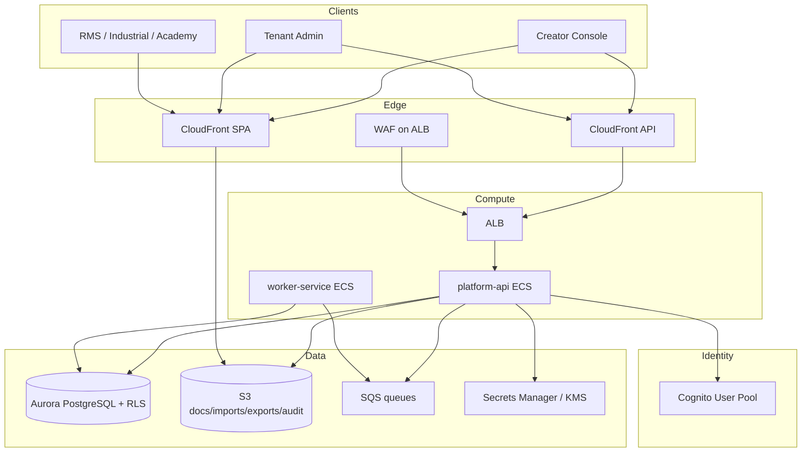
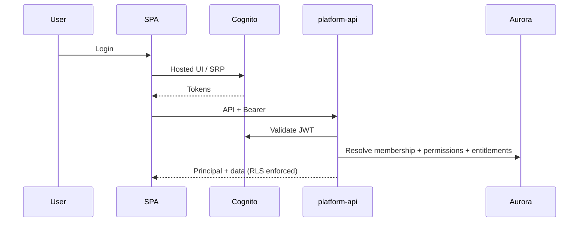
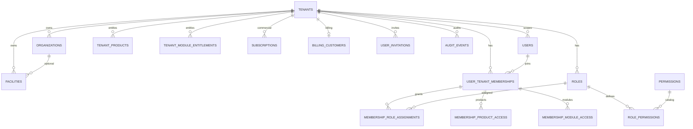

# Architecture — FORGE-SAAS-CORE

**Closeout:** MK-S24  
**Related:** [MK-S0-baseline.md](./MK-S0-baseline.md), [DEPLOYMENT.md](./DEPLOYMENT.md)

## System overview

Forge SaaS core is a multi-tenant NestJS API on ECS Fargate, Aurora PostgreSQL with FORCE RLS, Cognito authentication, SQS workers, and static Next.js exports (Creator Console, Tenant Admin) behind CloudFront + private S3.

## Frontend architecture

| App | Stack | Hosting |
| --- | --- | --- |
| Creator Console | Next.js 15 static export + Sneat | S3 + CloudFront OAC |
| Tenant Admin | Next.js 15 static export + Config Studio | S3 + CloudFront OAC |
| Product UIs | RMS / Industrial / Academy (product tracks) | Separate hosting / shared APIs |

Shared UI kits live under `packages/web-kit`, `packages/fx-*` where applicable. Auth client uses Cognito; API calls carry tenant context; capability UI is advisory only.

## Backend architecture

| Layer | Implementation |
| --- | --- |
| HTTP API | NestJS `apps/platform-api` |
| Auth context | Cognito JWT + optional local `x-forge-dev-principal` (local/dev/testing only) |
| Authorization | `@forge/authorization` + `PermissionGuard` |
| Persistence | Drizzle + `packages/database` |
| Isolation | Postgres FORCE RLS + application AuthZ |
| Side effects | Outbox + audit + SQS workers |

## Authentication diagram

## AWS map (SaaS platform CDK)

Stack order (`infrastructure/cdk/bin/forge-platform.ts`): Network → Security → Identity → Messaging → Data → Observability → Compute → Frontend / Backup / Audit.

| Concern | Construct / stack |
| --- | --- |
| Cognito | `forge-cognito` / Identity |
| Aurora | `forge-database` / Data |
| Buckets | `forge-buckets` / Data |
| ECS/ALB/WAF | `forge-ecs` / Compute |
| Static sites | `forge-*-hosting` / Frontend |
| API CF | `forge-api-cloudfront` |
| Alarms | `forge-monitoring` |
| Backups | `forge-backups` |

## ERD (core SaaS entities)

Logical ERD — not every column. Product tables (RMS/Industrial) omitted.

## Design principles

1. One tenant root (`tenants`) — no parallel accounts schema  
2. Entitlements gate product/module access; billing does not write entitlements from webhooks  
3. Server AuthZ is authoritative; UI `Can` helpers are UX only  
4. Migrations forward-only; production cutover separately authorized  
5. REUSE existing surfaces before NEW
