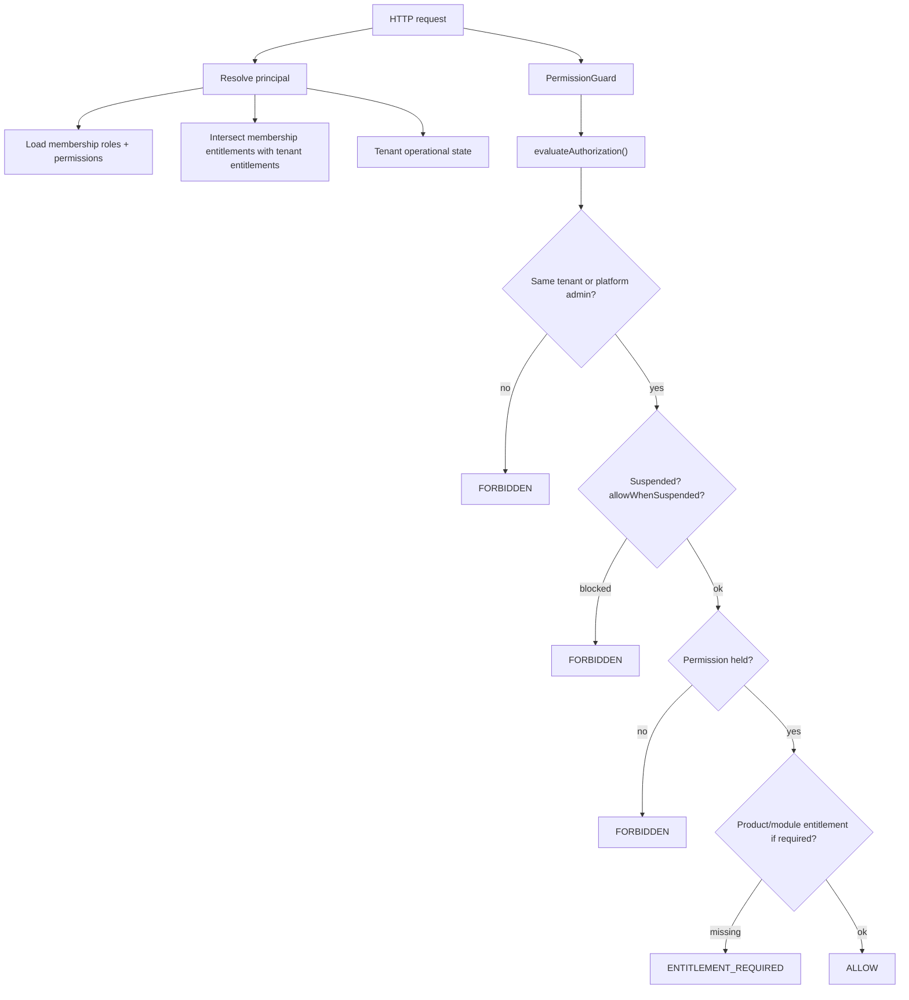

# Authorization — FORGE-SAAS-CORE

**Closeout:** MK-S24  
**Detail:** [RBAC.md](./RBAC.md), [MK-S21-security-review.md](./MK-S21-security-review.md)  
**ADR:** [ADR-015](../decisions/ADR-015-permission-based-authorization.md)

## Principles

1. Authorize on **permission codes**, not role display names.  
2. **Deny wins** over allow (`resolveEffectivePermissionCodes`).  
3. RLS is necessary; **AuthZ still validates** tenant/resource ownership.  
4. Creator-only permissions cannot be granted via tenant role APIs (MK-S21).  
5. UI capability checks never replace server evaluation.

## Authorization flow

## Layers

| Layer | Location |
| --- | --- |
| Permission catalog | `@forge/contracts`, DB `permissions` |
| Role templates | `role_templates` / seed |
| Tenant roles | `roles` + `role_permissions` |
| Membership grants | `membership_role_assignments` (+ product/module access) |
| Evaluation | `@forge/authorization` |
| Nest guards | `PermissionGuard`, `@RequirePermission` |
| Client | `usePermission` / `<Can>` |

## Isolation guarantees

| Threat | Control |
| --- | --- |
| Cross-tenant IDOR | Path tenant vs principal; RLS |
| Privilege escalation | Cannot grant creator-only or unheld permissions (MK-S21) |
| Suspended tenant access | Operational state; `allowWhenSuspended` only on platform/tenant-mgmt paths |
| Module/product disabled | Entitlement intersection + `requiresEntitlement` |

## Personas (SaaS)

| Persona | Template | Notes |
| --- | --- | --- |
| Platform / Creator | `PLATFORM_SUPER_ADMIN` / Creator roles | Cross-tenant with `isPlatformAdmin` |
| Owner | `TENANT_OWNER` | Tenant SaaS admin |
| Admin | `TENANT_ADMIN` | Parity core admin |
| Member | `STANDARD_USER` | Limited read |
| Viewer | `READ_ONLY_USER` | Read + audit read |

## Residual (MK-S21 MEDIUM — not blocking closeout docs)

Facility-depth ACL, outbound webhook timed signatures, API-key request auth, decorator lint — see security review.
