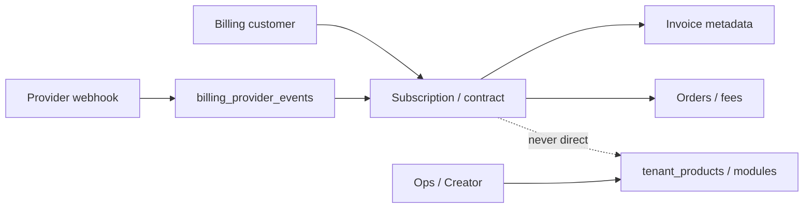

# Billing Domain (MK-S9)

Provider-neutral commercial billing on Forge. **Entitlements remain the source of truth for access (ADR-017).** Provider webhooks must never write `tenant_products` / `tenant_module_entitlements` directly.

## Billing lifecycle (conceptual)



Closeout note (MK-S24): live Stripe Customer Portal and live SES-adjacent dunning remain **DEFERRED** (BACKLOG-003 / MK-S23 SES gap). Default `billingProvider` is often `NONE` / stub.

## Logical models

| Model | Storage |
| --- | --- |
| Billing customer | `billing_customers` (1:1 tenant) |
| Plan | `subscription_plans` (existing) |
| Price | `prices` |
| Subscription | `subscriptions` (+ `billing_type`, `billing_customer_id`, `seat_quantity`) |
| Subscription item | `subscription_items` |
| Invoice metadata | `billing_invoices` |
| Order / order item | `billing_orders`, `billing_order_items` |
| Contract | `billing_contracts` |
| Implementation / migration fee | `billing_fee_lines` (`IMPLEMENTATION`, `MIGRATION`, …) |
| Billing event | `billing_provider_events` (+ local `subscription_events`) |

Migration: `packages/database/drizzle/0030_mk_s9_billing_domain.sql` (not applied to production in this sprint).

## Billing types

```text
MONTHLY, ANNUAL, PER_SEAT, PER_MODULE, BUNDLE, USAGE_READY,
MANUAL_ENTERPRISE_CONTRACT, COMPLIMENTARY, IMPLEMENTATION_FEE, MIGRATION_FEE
```

## Status mapping

Operational DB statuses (`TRIAL`, `ACTIVE`, `GRACE`, `SUSPENDED`, `CANCELED`) map to SaaS ADR-019 labels via `toSaasSubscriptionStatus` / `toOperationalSubscriptionStatus` in `@forge/contracts`.

## APIs

| Method | Path | Permission |
| --- | --- | --- |
| GET | `/api/v1/tenants/:tenantId/billing/overview` | `platform.entitlement.manage` **or** `tenant.billing.read` |
| GET | `/api/v1/tenants/:tenantId/billing/customers` | read |
| POST/PATCH | `/api/v1/tenants/:tenantId/billing/customers` | manage (PATCH audited) |
| GET/POST | `/api/v1/tenants/:tenantId/billing/contracts` | read / manage |
| PATCH | `/api/v1/tenants/:tenantId/billing/contracts/:id` | manage (dates, fees, notes, `pricingJson`) |
| POST | `/api/v1/tenants/:tenantId/billing/fees` | manage |
| POST | `/api/v1/tenants/:tenantId/billing/orders` | manage |
| GET/POST | `/api/v1/tenants/:tenantId/billing/invoices` | read / manage |
| POST | `/api/v1/platform/billing/webhooks/:provider` | manage |

## UX (MK-S10)

| App | Route | Role |
| --- | --- | --- |
| Creator Console | `/billing` | Overview + manual contract editor + contact |
| Tenant Admin | `/billing` | Read-only overview; portal stub unless `hostedInvoiceUrl` |

Contract `pricing_json` holds pricing override + per-module amounts. Live Stripe Customer Portal remains deferred (BACKLOG-003).

## Webhooks

- Signature: HMAC-SHA256 of raw body; header `x-forge-billing-signature: sha256=<hex>`
- Secret: `BILLING_WEBHOOK_SECRET` (STUB/NONE default for local: `forge-billing-stub-secret`)
- Unique `(provider, external_event_id)` → idempotent / duplicate-safe
- Retry-safe: failed events marked `FAILED` with error; success `PROCESSED`
- Logging: receipt outbox event + audit on domain writes

`entitlement.sync_requested` applies only through `EntitlementsService.putProduct` / `putModule`.

## Providers

| Code | Notes |
| --- | --- |
| `NONE` | Default; no PSP |
| `STUB` | Local/dev webhook testing |
| `MANUAL` | Enterprise contract path |
| `STRIPE` | Reserved — live adapter **not** in MK-S9 (BACKLOG-003) |

## Out of scope

- MK-S10 billing UX
- Live Stripe keys / production webhook endpoints
- Seat enforcement at login (BACKLOG-014)
