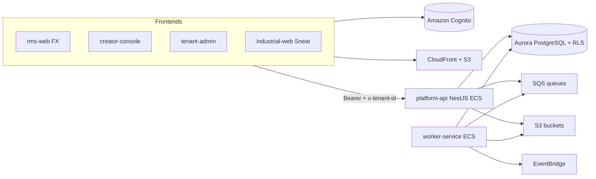
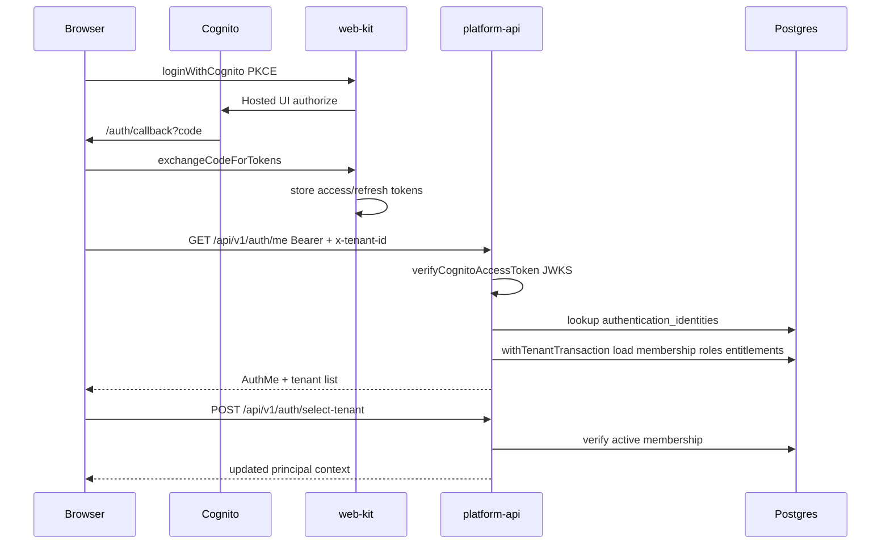
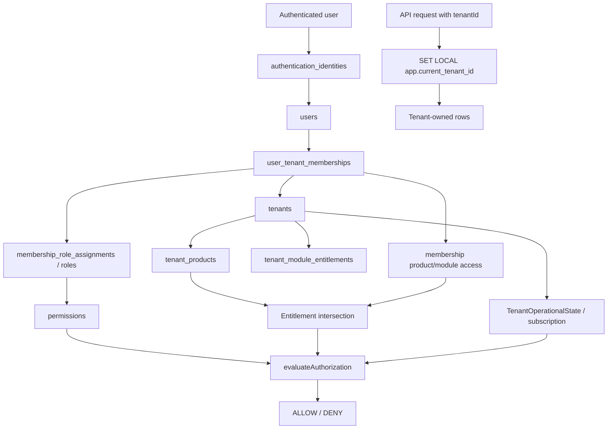
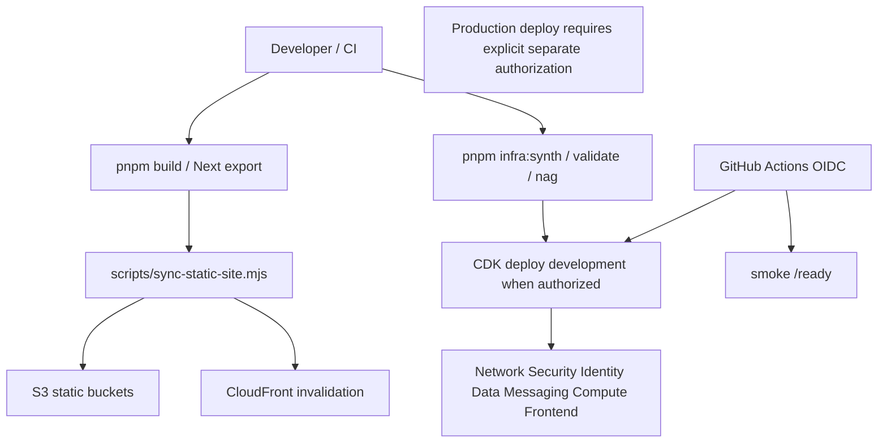

# MK-S0 Baseline — Forge SaaS Foundation

**Program:** FORGE-SAAS-CORE  
**Sprint:** MK-S0 (Baseline / Discovery)  
**Date:** 2026-08-10  
**Branch at baseline:** `master` @ `5cb5f6197393817dc056a6f8e30d1bda82a05c33` (ahead of origin)  
**Production operations:** NONE

This document is the authoritative discovery baseline for later FORGE-SAAS sprints. Prefer REUSE → EXTEND → HARDEN → REFACTOR → NEW. Do not create parallel v2 systems.

---

## 1. Repository inventory

### Top-level layout

| Area | Path | Role |
| --- | --- | --- |
| Apps | `apps/` | Product UIs, platform-api, workers, e2e |
| Packages | `packages/` | Shared `@forge/*` libraries |
| Infrastructure | `infrastructure/cdk/` | AWS CDK stacks and constructs |
| Scripts | `scripts/` | Onboarding, deploy sync, industrial ops, smoke |
| Docs | `docs/` | Architecture, ADRs, compliance, program evidence |
| Database local | `database/` | Docker Postgres init |
| Migration | `migration/` | Firebase migration placeholders |
| Storybook | `storybook/` | Component/docs tooling |
| Tests | `tests/` | Cross-cutting test assets (as present) |

### Apps

| App | Framework | Status |
| --- | --- | --- |
| `platform-api` | NestJS 11 / ECS | Active API |
| `worker-service` | Node/TS / ECS | Active SQS workers |
| `creator-console` | Next.js 15 static export | Active Creator Console |
| `tenant-admin` | Next.js 15 static export | Active Tenant Admin / Config Studio |
| `rms-web` | Next.js 15 + `@forge/fx-*` | Active RMS |
| `industrial-web` | Next.js 15 + Sneat Free | Active Industrial |
| `academy-web` | Next.js 15 | Scaffold |
| `forge-experience-reference` | Next.js 15 | Reference |
| `ai-narrative-api` | Nest routes (via platform-api) | Partial |
| `department-portal` | Placeholder | NOT_STARTED |
| `student-portal` | Placeholder | NOT_STARTED |
| `public-registration` | Placeholder | NOT_STARTED |
| `rms-web-e2e` | Playwright/e2e | Active |
| `configuration-e2e` | e2e | Active |

### SaaS-relevant packages

| Package | Path | Role |
| --- | --- | --- |
| `@forge/tenant-context` | `packages/tenant-context` | `ForgePrincipal`, permission/product/module helpers |
| `@forge/authorization` | `packages/authorization` | Policy evaluation, operational state, feature resolve |
| `@forge/auth` | `packages/auth` | Cognito JWT / JWKS verification |
| `@forge/database` | `packages/database` | Drizzle schema, migrations, RLS, seed |
| `@forge/contracts` | `packages/contracts` | Permission catalog, templates, shared types |
| `@forge/audit` | `packages/audit` | Audit event builders / redaction helpers |
| `@forge/security` | `packages/security` | Security utilities |
| `@forge/events` | `packages/events` | Outbox event types |
| `@forge/web-kit` | `packages/web-kit` | Cognito PKCE, AuthProvider, API client |
| `@forge/ui` | `packages/ui` | ForgeAppShell, `Can` gate |
| `@forge/design-system` | `packages/design-system` | Theme tokens |
| `@forge/fx-*` | `packages/fx-*` | RMS Experience UI system |
| `@forge/configuration` | `packages/configuration` | Config Studio schemas |
| `@forge/imports` / `@forge/import-center` | packages | Import platform |
| `@forge/observability` / `@forge/environment` | packages | Logging / env contracts |

### Tooling

- Package manager: pnpm `10.12.1` (Corepack)
- Orchestration: turbo
- Node: `>=20`
- ORM: Drizzle (no Prisma)
- Tests: vitest (primary), e2e packages for RMS/config

---

## 2. Capability matrix

Decision values: **REUSE** | **EXTEND** | **HARDEN** | **REFACTOR** | **NEW**

| Capability | Current Status | Implementation Location | Security Status | Tests | Decision | Notes |
| --- | --- | --- | --- | --- | --- | --- |
| Tenants | Implemented | `packages/database/src/schema/tenants.ts`; `apps/platform-api/src/modules/tenants/`; Creator `/tenants` | RLS + TenantGuard; platform vs tenant scope | Tenant isolation integration; sprint 1E e2e | **REUSE** | Status includes `PROVISIONING` default; suspend/archive fields present. Map SaaS “account/org commercial root” → tenant. |
| Organizations | Implemented | `schema/organizations.ts`; `modules/organizations/` | Tenant-scoped | Platform e2e / seed | **REUSE** | Hierarchy via `parentOrganizationId`; not the commercial tenant root. |
| Memberships | Implemented (ADR-021) | `schema/memberships.ts`; `modules/memberships/` | Server-side membership resolution in auth-context | Sprint 1E; unit helpers | **REUSE** / **HARDEN** | Authoritative `user_tenant_memberships`; keep dual-write projections from drifting. |
| Roles / permissions / RBAC | Implemented (ADR-015) | `@forge/authorization`; schema `authorization.ts` / `platform.ts`; `PermissionGuard` | Permission codes; deny wins; decision log | `authorization.evaluate` tests; permission matrix scripts | **REUSE** / **HARDEN** | Avoid role-name checks; migrate remaining product if/else gradually (later sprints). |
| Auth / Cognito / sessions | Implemented (ADR-013/029) | `@forge/auth`; Identity CDK; `auth-context.service.ts`; `@forge/web-kit` | Bearer required for protected APIs; session revoke via `sessionsRevokedAt` / Cognito global sign-out | Cognito smoke/scripts; auth unit paths | **REUSE** / **HARDEN** | Do not introduce alternate IdP. Industrial Cognito client gap → BACKLOG-001. |
| Portal accounts / sessions | Not productized | Cognito clients for department/student; placeholder apps | Clients exist; apps NOT_STARTED | None | **NEW** / **EXTEND** users | Use shared users/memberships; no separate portal_accounts table today. |
| Invitations | Implemented (ADR-020) | `user_invitations`; `modules/invitations/`; Cognito admin | Token SHA-256 hash only; Cognito rollback on failure | Sprint 1E invitation flows | **REUSE** / **EXTEND** | SES branded email deferred (MK-S13). |
| Products / modules / entitlements | Implemented (ADR-017) | `schema/entitlements.ts`, `platform.ts`; `modules/entitlements/`, `products/` | Entitlement intersect membership grants | AuthZ entitlement checks | **REUSE** / **HARDEN** | Permission ≠ subscription; both required. |
| Feature flags | Implemented | `feature_definitions` / `feature_overrides`; `modules/feature-flags/` | Must not grant unpaid access | Resolve helpers in authorization | **REUSE** | Overrides user > org > tenant pattern documented. |
| Subscriptions / billing domain | Partial | `subscriptions*`; `modules/subscriptions/` | Operational gates (ADR-019) | Suspend denies product use | **EXTEND** | Provider default `NONE`; Stripe = NEW (MK-S9). |
| Stripe / PSP | Missing | — | N/A | N/A | **NEW** | BACKLOG-003 |
| Creator Console | Active | `apps/creator-console/` | Platform-admin permissions; Cognito creator client | configuration-e2e / console flows | **REUSE** / **REFACTOR** client | Control plane — extend, do not replace. |
| Tenant Admin | Active | `apps/tenant-admin/` | Tenant-scoped Config Studio authz | Config matrix / e2e | **REUSE** / **EXTEND** | Customer admin surface. |
| Customer portals | Placeholder | `department-portal`, `student-portal`, `public-registration` | Cognito clients ready | None | **NEW** | BACKLOG-007 |
| Onboarding / provisioning | Implemented (ADR-027) | `schema/onboarding.ts`; `modules/onboarding/`; `scripts/onboard-tenant.ts` | Starts `PROVISIONING`; activation gate → ACTIVE | Session validation errors | **REUSE** / **EXTEND** | Runbook: `docs/operations/customer-onboarding-runbook.md`. |
| Notifications / email / SES | Stub | SQS notifications queue; Config Studio templates; Cognito email | Cognito suppress outside prod | None for SES | **NEW** (+ **EXTEND** templates) | BACKLOG-004; no SES CDK. |
| Audit logging | Implemented | `@forge/audit`; `audit_events`; CloudTrail audit stack | Append-only app audit; redaction | `@forge/audit` tests | **REUSE** / **HARDEN** | Archive/export completeness later. |
| Storage / branding | Implemented | S3 buckets construct; `modules/branding/`; upload services | Tenant-scoped keys; KMS; malware quarantine pattern for imports | Import/document storage tests | **REUSE** / **EXTEND** | Branding stores logo/icon as document refs. |
| API keys (tenant product) | Missing | Import source `api_key` type only | Secret refs for CAD | N/A | **NEW** | BACKLOG-005 |
| Webhooks / integrations | Partial | CAD webhook modules; integrationEvents SQS | HMAC/replay for CAD | CAD security docs/tests | **REUSE** CAD; **NEW** generic outbound | BACKLOG-006 |
| Platform analytics | Missing as SaaS core | Industrial UI expects analytics APIs | N/A | Parity scripts elsewhere | **NEW** / deferred | BACKLOG-002; MK-S20 later |
| Application shell | Partial multi-track | `@forge/ui` shells; RMS fx shell; Industrial Sneat | Client auth guards + server guards | Product e2e | **EXTEND** | MK-S8; do not clone Makerkit look. BACKLOG-009 |
| Canonical facilities model | Fragmented | Config Studio facilities; RMS `rms_stations`; orgs tree | Varies by product | Product-specific | **REFACTOR** / **EXTEND** | MK-S1. BACKLOG-010 |
| `@forge/tenant-context` | Implemented | `packages/tenant-context` | Canonical principal contract | Unit tests | **REUSE** | Align later helpers to this package. |

---

## 3. Current architecture

### 3.1 Frontend

- **Framework lock:** Next.js 15 App Router + React 19 + TypeScript; static export for console/tenant-admin/rms/industrial hosting.
- **Auth client:** `@forge/web-kit` Cognito Hosted UI PKCE; tokens in localStorage; `x-tenant-id` on API calls; Creator still has local API client (BACKLOG-008).
- **Shells:** Creator/Tenant Admin → `ForgeAppShell` (`@forge/ui`); RMS → FX shell; Industrial → Sneat Free vendored CSS + `IndustrialShell`.
- **Guards:** Client `RequireAuth` / AuthProvider; UI capability via `hasPermission` / `Can`. Server authorization is authoritative.

### 3.2 Backend

- **API:** NestJS `apps/platform-api` on ECS Fargate (not Lambda for primary API).
- **Guards:** `AuthGuard` → `TenantGuard` → `PermissionGuard` + idempotency interceptor + global exception filter.
- **Workers:** `apps/worker-service` consumes SQS (imports, CAD, integration events) and publishes outbox → EventBridge.
- **Modules present:** auth-context, tenants, organizations, persons, users, memberships, invitations, authorization, products, entitlements, subscriptions, feature-flags, branding, configuration, onboarding, audit, outbox, cognito, imports, neris*, cad, rms, ai-narrative.

### 3.3 Authentication

1. Browser starts Cognito PKCE via web-kit.
2. Callback exchanges code for tokens.
3. API `GET /api/v1/auth/me` with Bearer (+ optional `x-tenant-id`).
4. `verifyCognitoAccessToken` (jose JWKS) → identity lookup → memberships/permissions/entitlements → `ForgePrincipal`.
5. Tenant switch: `POST /api/v1/auth/select-tenant` (server verifies membership).
6. Logout-all bumps session version + Cognito global sign-out.
7. Dev-only principal header allowed when `APP_ENV` ∈ local/development/testing.

### 3.4 Tenant model

- **Commercial root:** `tenants` (statuses include provisioning/active/suspend/archive semantics).
- **Within tenant:** organizations, people, users, memberships, roles, products/modules, branding, settings, domains.
- **Isolation:** Shared Aurora Postgres + RLS GUCs `app.current_tenant_id` / `app.current_user_id` via `withTenantTransaction` (ADR-012/014).
- **Sites/facilities:** product-specific today (RMS stations vs Config Studio facilities) — MK-S1.

### 3.5 Authorization

Central evaluation in `@forge/authorization` (`evaluateAuthorization`): tenant match → operational/subscription state → entitlement → permission codes. API uses `@RequirePermission`. Role names must not be the authorization source of truth.

### 3.6 Data model (core SaaS entities)

Schema root: `packages/database/src/schema/`  
Migrations: `packages/database/drizzle/`

Present: tenants, tenant_domains/settings/branding, organizations, persons, users, authentication_identities, user_invitations, user_tenant_memberships + role/product/module grants, permissions/roles/templates, platform_products/modules, tenant_products, tenant_module_entitlements, subscriptions/events/plans, feature_definitions/overrides, onboarding sessions/steps, audit_events, idempotency, outbox.

Absent / weak: Stripe customers, portal_sessions, tenant API keys registry, SES outbox store, generic webhook endpoints table.

### 3.7 AWS architecture (code inventory)

CDK entry: `infrastructure/cdk/bin/forge-platform.ts`

| Stack | Services (code) |
| --- | --- |
| Network | VPC, security groups, flow logs |
| Security | KMS keys |
| Identity | Cognito user pool + app clients |
| Messaging | SQS (+ DLQ), EventBridge |
| Data | Aurora PostgreSQL Serverless v2, S3 (documents/imports/exports/auditArchive/applicationAssets) |
| Compute | ECR, ECS Fargate (API + worker), ALB, WAF, API CloudFront |
| Frontend | S3 + CloudFront (Creator, RMS, Tenant Admin; Industrial hosting construct) |
| Observability / Monitoring | CloudWatch logs, alarms/dashboard constructs |
| Backup | AWS Backup |
| Audit | CloudTrail (+ SNS alarms) |

**Present in code:** Cognito, RDS/Aurora, S3, CloudFront, Lambda (edge/optional patterns), API Gateway not primary (ALB), SES **not found**, SNS (alarms), SQS, EventBridge, Secrets Manager / SSM patterns, CloudWatch, WAF, Route 53/ACM via edge TLS ADR/patterns, DynamoDB **not used for SaaS core**.

### 3.8 Deployment flow

- Static apps: `pnpm deploy:console|rms-web|tenant-admin|industrial-web` → `scripts/sync-static-site.mjs` (build → S3 → CloudFront invalidate).
- Infra: `pnpm infra:synth|validate|nag|diff|deploy` via `@forge/infrastructure-cdk`.
- CI: `.github/workflows/ci.yml`, `deploy-development.yml` (OIDC), `rms-e2e.yml`.
- **MK-S0 does not deploy.** Production deploy prohibited without separate authorization.

---

## 4. Mermaid diagrams

### 4.1 Current system architecture

### 4.2 Authentication flow

### 4.3 Tenant data flow

### 4.4 Deployment flow

---

## 5. Duplicate / partial SaaS services

| Risk | Observation | Guidance |
| --- | --- | --- |
| Dual membership projections | `user_tenant_memberships` authoritative; `user_tenant_access` compat projection | HARDEN in membership sprints; do not invent third model |
| Org membership vs tenant membership | `organization_memberships` (person↔org) ≠ tenant user membership | Keep distinct; document in MK-S1/S3 |
| Multiple shells | ui / fx / sneat | EXTEND carefully in MK-S8; no Makerkit clone |
| Billing placeholders vs live PSP | Subscriptions exist; Stripe absent | EXTEND domain then NEW adapter |
| Import API keys vs platform API keys | Connector credentials ≠ SaaS API keys | NEW for MK-S15 |
| Analytics | Industrial UI ahead of API | Product backlog; not MK-S0 fix |

---

## 6. Baseline verification

Commands and outcomes are recorded in `sprints/MK-S0-COMPLETE.md` after execution.

Repository-defined scripts inspected:

- `pnpm lint`, `pnpm typecheck`, `pnpm test`, `pnpm test:unit`, `pnpm build`
- `pnpm smoke:development` (environment-dependent; not a substitute for production deploy)
- No dedicated `production-check` script name in root `package.json`; use `infra:validate` / `infra:nag` as infra health alternatives when run

Policy: do not repair historical failures in MK-S0.

---

## 7. Sprint mapping guidance (post-S0)

| Upcoming sprint | Primary reuse target |
| --- | --- |
| MK-S1 Core tenant domain | `tenants` + branding/settings/domains; clarify facilities |
| MK-S2 Auth sessions | Cognito + auth-context + web-kit |
| MK-S3 Membership context | ADR-021 memberships + select-tenant |
| MK-S4 RBAC | `@forge/authorization` + PermissionGuard |
| MK-S5 Entitlements | products/modules modules already present |
| MK-S6 Invitations | ADR-020 invitations module |
| MK-S7 Onboarding | ADR-027 onboarding + onboard-tenant script |
| MK-S8 Shell | Extend existing shells; Sneat for industrial direction |
| MK-S9+ Billing | Extend subscriptions; NEW PSP adapter |
| MK-S11 Creator | Extend `apps/creator-console` |
| MK-S12 Tenant Admin | Extend `apps/tenant-admin` |

---

## 8. Working tree caution (MK-S0)

At sprint start, unrelated WIP existed on `master` (industrial-web branding/theme, contracts analytics, evidence scripts, `.tmp-*`). MK-S0 commits **only** `docs/forge-saas-foundation/**` and does not reset or overwrite that work.
