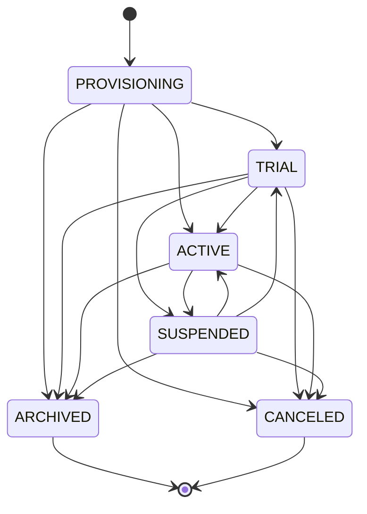

# Forge Tenancy Model (MK-S1)

Canonical commercial and structural tenancy for FORGE-SAAS-CORE.

## Commercial root

**Canonical entity:** `tenants` (`packages/database/src/schema/tenants.ts`)

| Concept | Representation |
| --- | --- |
| Tenant / organization (billing customer) | `tenants` |
| Tenant settings | `tenant_settings` |
| Tenant branding | `tenant_branding` |
| Tenant domains | `tenant_domains` |
| Tenant products | `tenant_products` |
| Tenant modules | `tenant_module_entitlements` |

Do not introduce `tenants_v2` / `accounts` tables. Map SaaS “account” language to `tenants`.

## Tenant status lifecycle

Canonical statuses (`@forge/contracts` `TENANT_STATUSES`):

```text
PROVISIONING → TRIAL → ACTIVE ⇄ SUSPENDED → ARCHIVED
                     ↘         ↘
                      CANCELED   CANCELED
```

Legacy `DECOMMISSIONED` (if present) is treated as inactive by `@forge/authorization` (alias of archived/canceled behavior).



Transitions enforced via `assertTenantStatusTransition` / TenantsService. See [AUTHORIZATION.md](./AUTHORIZATION.md) for suspended operational gates.

## Facilities / sites

**Canonical entity:** `facilities` (MK-S1)

- Always owned by `tenant_id`
- Optional link to `organizations.id` (must be same tenant)
- Unique `(tenant_id, facility_key)`

### Adapters (not parallel roots)

| Existing surface | Relationship |
| --- | --- |
| Config Studio `facilities` namespace | Configuration document — may later sync into `facilities` |
| RMS `rms_stations` | Product-specific fire stations — keep; map to platform facility when needed |
| Industrial “sites” UI | Should resolve against platform `facilities` over time |

## Departments

**Canonical approach:** organizations under a tenant.

- Seeded organization type `DEPARTMENT` (MK-S1)
- Existing customer types (`FIRE_DEPARTMENT`, etc.) remain valid top-level org types
- Hierarchy via `organizations.parent_organization_id`

## Authorization reminder

Facility and organization references in APIs must verify `resource.tenantId === path/header tenantId`. RLS is necessary but not sufficient by itself for cross-tenant ID substitution defenses.
