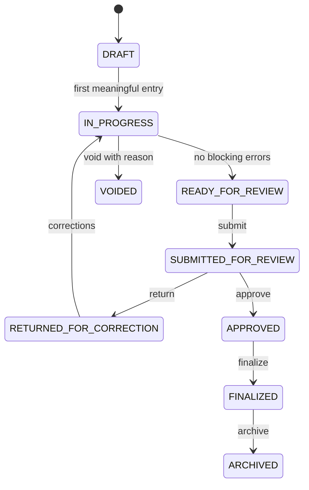

# NERIS Incident Shell

The incident shell is the tenant-scoped operational core for NERIS reporting in Phase 2.

## Tables (migration `0010`)

| Table | Role |
| --- | --- |
| `neris_incidents` | Header, status, schema version pin, incident number |
| `neris_incident_sections` | Section completion tracking |
| `neris_incident_field_values` | Typed EAV answers ([ADR-031](../../architecture/adr/ADR-031-neris-field-storage.md)) |
| `neris_incident_repeatable_*` | Repeatable group/item structure |
| `neris_incident_units` / `neris_incident_personnel` | Assignment rows |
| `neris_incident_locations` / `neris_incident_addresses` | Location capture |
| `neris_incident_timestamps` | Dispatch timeline with correction audit |
| `neris_incident_number_*` | Numbering config, sequences, ledger ([ADR-033](../../architecture/adr/ADR-033-incident-numbering-for-update.md)) |
| `neris_incident_status_history` | Workflow audit trail |
| `neris_incident_validation_*` | Validation runs and results |
| `neris_incident_review_*` | Review assignments and comments |
| `neris_incident_schema_snapshots` / `neris_incident_configuration_snapshots` | Immutable snapshots ([ADR-032](../../architecture/adr/ADR-032-schema-config-snapshots.md)) |
| `neris_incident_narratives` / `neris_incident_narrative_versions` | Narrative with version history |

All tables are FORCE RLS via `packages/database/src/rls.sql.ts`.

## State machine

Implementation: `IncidentStateMachine` in `apps/platform-api/src/modules/neris-incidents/`.

## Default sections

Created on incident insert: `OVERVIEW`, `DISPATCH`, `LOCATION`, `UNITS_PERSONNEL`, `CLASSIFICATION`, `APPLICABLE_MODULES`, `NARRATIVE`, `REVIEW`.

## Permissions

Fifteen `rms.neris.incident.*` codes plus configuration, validation, and audit view permissions — see [feature flags](../operations/feature-flags.md).

## API surface

See [Incidents API](../api/incidents.md).
