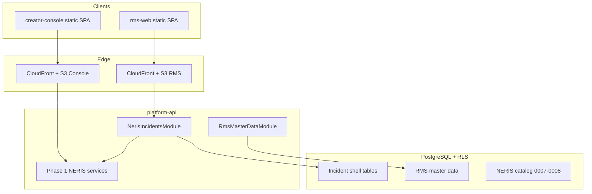

# NERIS Phase 2 — Architecture Overview

**Phase:** Core Incident Shell + MANUAL_ONLY intake  
**Status:** Implemented (Wave 8 docs + hosting IaC)  
**Last updated:** 2026-07-26

## Purpose

Phase 2 turns the Phase 1 NERIS schema registry into an operational incident shell: versioned workflow, transaction-safe numbering, schema-driven manual intake in `apps/rms-web`, officer review, tenant configuration editing, and progressive validation — without CAD adapters or external NERIS submission.

## Layered architecture

## Key decisions (ADRs)

| ADR | Topic |
| --- | --- |
| [ADR-031](../../architecture/adr/ADR-031-neris-field-storage.md) | Typed EAV field storage |
| [ADR-032](../../architecture/adr/ADR-032-schema-config-snapshots.md) | Schema + configuration snapshots |
| [ADR-033](../../architecture/adr/ADR-033-incident-numbering-for-update.md) | Incident numbering (`FOR UPDATE`) |
| [ADR-034](../../architecture/adr/ADR-034-effective-form-descriptor.md) | Effective form descriptor |
| [ADR-035](../../architecture/adr/ADR-035-autosave-concurrency-if-match.md) | Autosave + If-Match concurrency |

Phase 1 registry decision: [ADR-030](../../decisions/ADR-030-neris-schema-registry-overlays.md).

## Scope boundaries

**In:** RMS master-data foundations, incident shell, MANUAL_ONLY intake UI, officer review, tenant NERIS configuration editor, validation, duplicate detection (advisory), narrative foundation, CloudFront hosting for rms-web.

**Out:** CAD adapters/UI/credentials, NERIS external/state submission, offline sync, advanced fire/hazmat/rescue/CRR/health workflows, creator-console → `@forge/web-kit` consolidation (deferred).

## Related docs

- [Incident shell](./incident-shell.md)
- [Master data](./master-data.md)
- [Form rendering](./form-rendering.md)
- [Phase 2 status](../roadmap/phase-2-status.md)
