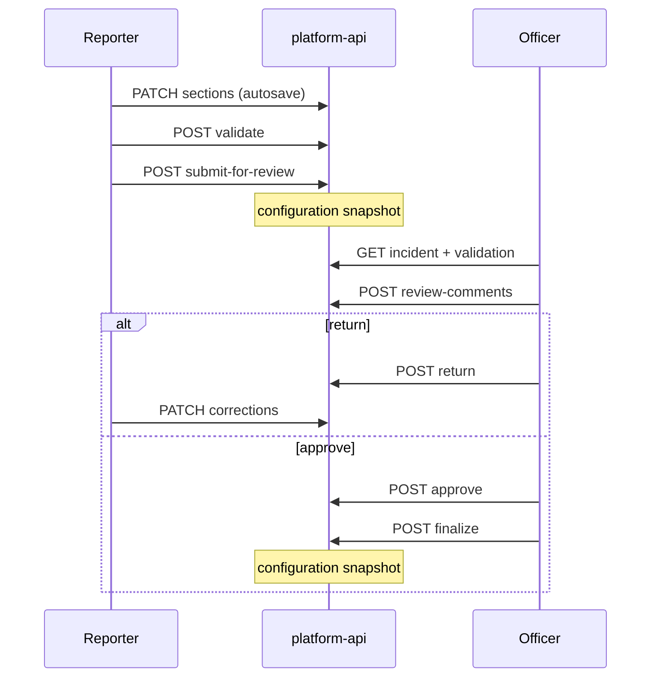

# Officer Review Workflow

Officer review is gated by `rms.neris.officer_review.enabled` and permissions `rms.neris.incident.submit_review`, `.review`, `.approve`, `.return`.

## Roles

| Actor | Typical permissions |
| --- | --- |
| Firefighter / reporter | `create`, `edit`, `submit_review` |
| Officer / reviewer | `review`, `approve`, `return` |
| Admin | `finalize`, `void`, `archive`, audit view |

Exact grants come from RMS starter role templates seeded in `@forge/contracts`.

## Flow

## Review UI (rms-web)

Route: `/review`

- Queue/filter incidents in reviewable statuses
- Validation results and incomplete section indicators
- Section/field comments — comments **never mutate** incident field values
- Return action links to affected fields where possible
- Status and audit history read-only views

Reviewable statuses constant: `READY_FOR_REVIEW`, `SUBMITTED_FOR_REVIEW`, `RETURNED_FOR_CORRECTION`, `APPROVED`.

## API endpoints

| Method | Path | Target status |
| --- | --- | --- |
| `POST` | `…/submit-for-review` | `SUBMITTED_FOR_REVIEW` |
| `POST` | `…/return` | `RETURNED_FOR_CORRECTION` |
| `POST` | `…/approve` | `APPROVED` |
| `POST` | `…/finalize` | `FINALIZED` |
| `GET/POST` | `…/review-comments` | — |

Full list: [Incidents API](../api/incidents.md).

## Snapshots

Configuration snapshots are written on submit and finalize ([ADR-032](../../architecture/adr/ADR-032-schema-config-snapshots.md)).

## Out of scope

- External NERIS/state submission after finalize
- Multi-level approval chains beyond return/approve
- CAD-sourced auto-submit
